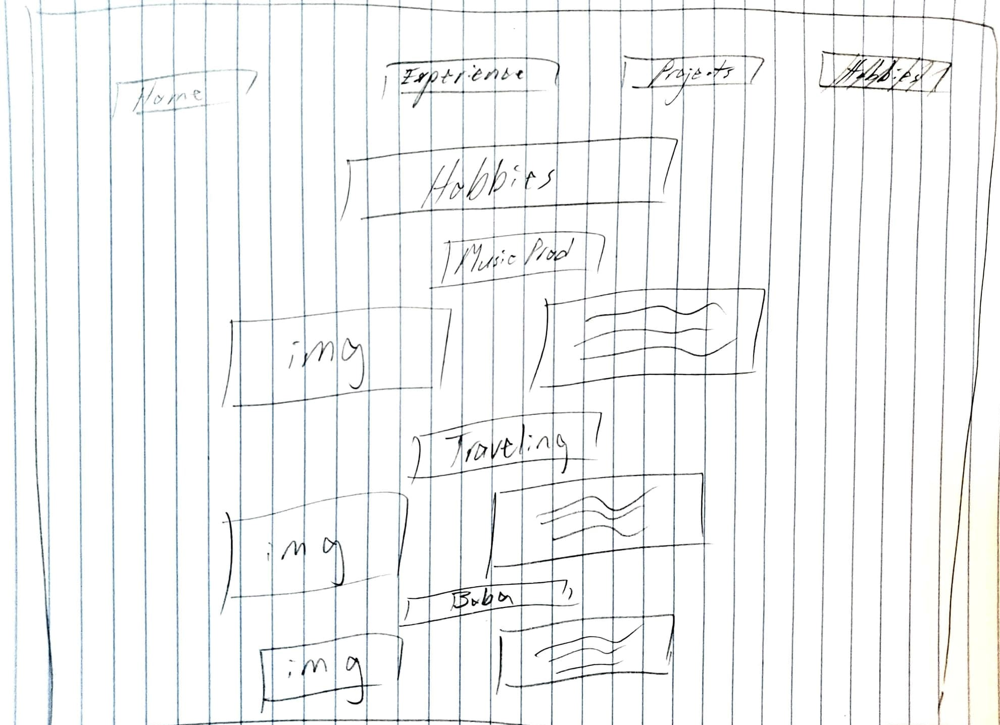

# Project 1: Design Journey

## Audience & Content

**Make the case for your decisions using concepts from class, as well as other design principles, theories, examples, and cases from outside of class.**

You can use bullet points and lists, or full paragraphs, or a combo, whichever is appropriate. The writing should be solid draft quality but doesn't have to be fancy.

**No sketches are required for Milestone 1.**

### Website Topic (Milestone 1)
> Briefly explain what your website will be about.

My website will a personal collection of my achievements and relative experience towards desired occupation and also details about the hobbies I enjoy doing.

### Audience (Milestone 1)
> Briefly explain who the intended audience(s) is for your website. Be specific and justify why this audience is appropriate for your site's topic.

My intended audience would be for recuiters and future employers. This is an appropriate audience because my site will feature my achievements that I have accomplished and post my relevant experience towards the role I am applying for, providing them easy access to my credentials. My hobbies would allow the audience to have a better understanding of what I do in my free time apart from academics.

### Final Content (Milestone 1)
> Briefly describe the content you plan to include in the final site, and why it's the right content for your audiences.

I intend to include a pdf attachment to my resume, a list of brief details regarding specific experiences in my resume, links to Medium articles I published with small descriptions about them, and potential audio recordings of music samples I have composed with description about how I came to be invested in this hobby.

### Home Page Content (Milestone 1)
> Briefly identify what content you will include on the homepage and why this content should be the first thing your target audience sees when they visit your site.

My homepage would include a brief description about myself and the reason why I am interested in pursuing this particular occupation. I would have a photo of myself above the brief description and then list my contact information near the bottom of the page.

## Information Architecture

**Make the case for your decisions using concepts from class, as well as other design principles, theories, examples, and cases from outside of class.**

Each section is probably around 1 reasonably sized paragraph (2-4 sentences).

**No sketches are required for Milestone 2.**

### Audience (Milestone 2)
> A clearer description of audience: who are they, what are they interested in with respect to this site, and what are the design goals for that audience.

The audience will be recruiters and potential employers, most likely in the tech industry. They would be interested in looking at my past and current experiences in the product field and seeing how these experiences will help my application for a product management role. The design goals for this audience would be to have a clear navigation path towards grouping related my experiences, hobbies, and also projects.

### Organization & Navigation (Milestone 2)
> A description of how you generated and considered alternatives for the site's content organization and navigation. You are required to include images here of your card sorting for determining the organization of content and the navigation.

> Thoroughly document this process. The _process_ is the important part of this assignment, not the final result.]

First, I listed out all the content that I want to talk about. This included various experiences, coding projects, published articles, and hobbies that I wanted to write and further elaborate on.

Afterwards, I began to think about what sort of categories would recruiters and potential employers would want to view. From here I began to realize that the target audience would want to first view my experiences such as internships and leadership positions to determine how qualified I am for the position. Therefore, I began to group all of my internship and leadership experiences together under "Related Experiences".

Next, the target audience would want to view the physical work and projects I have created to see what I have done and determine if my work matches what I have talked about in my relevant experience group. Therefore, I began to group tangible projects that I have completed that can be viewed by recruiters and potential emplyoers, hence my published articles and code projects.

Lastly, after grouping together both "Related Experiences" and "Projects", the final cards I have left all matched under personal interests that I have. Therefore, those easily were able to be grouped together under the category "Hobbies" that recruiters and future employers can view to see what I like to do outside of academics and the industry.

Adding titles to each group, my final card sorting diagram looks like this:

### Final Organization and Navigation (Milestone 2)
> Explain how the final organization of content and navigation is appropriate for your target audiences.

The final organization of content is appropriate because it is grouped in a way that all the different experiences into one page, while the different projects such as programs and published articles are grouped, and my hobbies are all grouped together. This is appropriate for recruiters and potential employees as they will be able to easily navigate the website to the relative topics to find all the related and detailed content correlated to each respective topic.

## Visual Design

**Make the case for your decisions using concepts from class, as well as other design principles, theories, examples, and cases from outside of class.**

Remember to focus on the things we can't see just by looking at the site: changes, alternatives considered, processes, and justifications.

Each section is probably around 1 reasonably sized paragraph (2-4 sentences).

### Theme Ideas (Milestone 3)
> Discuss several ideas about styling your site's theme. Explain why the theme ideas are appropriate for your target audiences. Feel free to include some hand-drawn sketches (not digital drawings, not mock-ups, not wireframes, etc.) here to document your design process.

The first theme would be a more professional and modern theme. This means that I would be choosing a dark blue theme that sets the professional tone for the target audience, but also at the same time the darkness of the color ensures that the site radiates a sense of reliability and strength. In addition a san-serif font will show a more moderen approach which relates to the tech industry that I hope to aim for. As my personal website would be to showcase achievements and relative experiences in hopes of recruiters and potential employers to view it, a blue professional theme seems appropriate

The second theme would be with a cream and ivory color, giving off a pure and elegant theme. This is appropriate for my personal website as the colors are quiet and gives off some warmth into it,showing an elegant appeal which can help when the target audience looks over my experiences. I would pair this with a serif font that will complement well with the cream color to give a traditional and warm appearance.

### Theme Design (Milestone 3)
> Discuss your theme designs: how did you come to them, what are their strengths and weaknesses, how do they fit your overall design goals and audiences?

The first theme of professional and modern theme was something that came to me as I was thinking of wanting to portray both my experiences and accomplisments in a way that signifies that I am serious about taking up a product management position but at the same time wanting to show that I am up-to-date on current trends and technology. This helps fit in my overall design goal of showcasing my qualification in both design and technical for the product side of the tech industry. Strengths of this design is that it would be sleek and modern showing that I am capable, both design and technical-wise, for the applied position. However, the weakness would be that the professionalism may too be too serious and lack the creativity or looser theme, and may give off the wrong impression to employers that I am too strict and potentially uptight.

The second theme was to portray a more elegant and traditional theme for showcasing my experiences and projects. This came to me as an alternative to a typical professional page but sometime that still represent a more serious theme but in a more aesthetic way. The strength of this is that it will be different from standard blue traditional pages and can show a more artistic yet traditional side of my personal website. However, the weakness to this is that this may appear a bit too traditional for the tech industry and can potentially be seen as being too outdated. Overall this theme fits my design goal of taking a more aesthetic and elegant take towards designing my personal website, which can appeal and fit well with the target audience for making my website to portray as a professional and relevant portfolio for my applications with their companies.

> Emotion is a big part of design. What emotions where you thinking about or trying to convey in your designs?

In my designs, I have been trying attempt emotions of professionalism, creativity, and also elegance towards the design of the overall. Being able to construct the website in a way that can show off my acheivements in a manner that allows the target audience of recuiters to be not only amazed at the website's structure, but also to gather a sense of professionalism and creativity from my website will help solidfy my goal of improving my chances of receiving an interview from their companies.

## Rationale

**This rationale should be polished writing: one you might submit as a report to a client or boss to help explain the project and convince them you did a good job. You'll be surprised how much writing and communicating you need to do about projects and choices on internships and jobs; practice that here.**

It should be a comprehensive, complete story of the project. You might find that each section runs a few paragraphs (1-2). Sketches can often help tell the story of your design. Screenshots are also useful for describing issues discovered during the design process and how you addressed them.

**All images must be visible in Markdown Preview for credit!**

Your rationale should be a polished version of the earlier explanations.

This project is to create a personal website that would allow the target audience, recruiters and potential employers, to see my accomplishments and experiences in order to give them a more insightful perspectives towards my background for their decision on my application to their company's job position.

With this, I began to create four pages, including the home page (index.html) which are individually about the projects, experience, and hobbies that I have done. Each of these pages were created from card sorting the various activities that I have done in order to organize them into sections that were the most appropriate to the target audience of what they would like to visit and explore on the website.

From here, there are two potential proposals for setting up the theme of the website. The first proposal is to have a professional and modern theme to the website. This would be using a more dark blue background while incorporating a san-serif font, in order to showcase a sleek, modern and professional portfolio towards the recruiters. This would be appropriate for recruiters, especially in the tech industry, for indicating that I am caught up with current trends and am readily adaptable to any changing situation. The strength of this design is that this fits in well with the current landscape of the tech industry and that the theme would give off the impression that I am capable of adapting to any changes to the industry. However, the weakness of the design is that the color and font may be too typical and that others may have roughly the relatively the same thing as well, thereby grouping my portfolio with others and unable to differentiate from others.

The second proposal is to showcase a more elegant and traditional theme to the webste. This would using a cream-color background while using a serif font to bring a more traditional theme to it, while using slightly constrating colors to compliment the cream-color. This would be appropriate for the target audience, as it creates an elegant and cool theme that would showcase my acheivements in this more elegant fashion and indicating to the audience that I am competent in both design and techncality for the potential position I would be applying for. The strength of this theme would be that this can showcase a more aesthetic version of the website and letting recruiters get a sense of elegance and confident emotions emitting off the content of the website. However, the weakness towards this design would be that it is possible that the more traditional theme can be a negative aspect and deter tech recruiters because it might give off the false assumption that I am more old-fashioned and unable to adapt to the change.

### Site Layout (Final Submission)
> Show your design process and final layout for your site. You must include photos of your sketches of the layout. No digital drawings permitted.

> You must label each figure and provide an explanation of the sketch.

Home Page Sketch. Users will be able to see a horizontal navigation bar to easily navigate between pages. The organization is centered left to right. My name and short description will be on the left. A headshot and contact will be on the right. These spaces between each category helps with grouping and allows readers to easily understand that there are four separate areas on the homepage.

The experience page will all be center in the center for easier flow from each experince. There will be two groupings of "Work Experience" and "Leadership". The individual experience will be spaced correctedly to make sure that the audience will easily differentiate which experiences belong to which group. Each experience will have the following format: Company name, company image, position, and unordered lists explaining experience.

The project page will be organized where the title of the projects will all be positioned to the right, while the unordered lists will be on the left to briefly descripe each topic. There will be adequate margins between each project to make sure there is no accidential perception of grouping by the audience.

The hobbies page will be organized by having all hobbies centered. There will be margins to group content by each hobby. The image of the hobbies will positioned on the right while short descriptions of the hobbies will be positioned on the left.

### Audience (Final Submission)
> A complete and polished description of the intended audience(s) for your website.

The intended audience for my website are recruiters and potential employers. Because the priority for me currently is to get an internship that can lead to full-time offer for next year, it is critical for me to make sure I have my website tailored towards my intended audience. This audience of recruiters and potential employers are most likely from the tech industry and looking for someone fit for an associate product management position.

### Design Goals (Final Submission)
> An explanation of the design goals for that audience, based on your earlier rationales.

The design goal for the audience will be for the recruiters and potential employers to easily see and understand the groupings of different sections. They should be able to easily see which image, description, or paragraph correlates to which experience or topic. Spacing and margins should be proficient to avoid any confusion of groupings or difficulty discerning various contents.

### Navigation (Final Submission)
> An explanation of how the final navigation met your goals and why its appropriate for your audience(s).

The final navigation met my goals because it is easy to navigate between the different pages and the easy to discern important or relevant content. The navigation is appropriate for the audience because the navigation, specifically the order of the navigation bar, is organized in a way so the content that recruiters most want to see would be labeled first (left side) and the least interested content the farthest away (right side). This is so that the first text that the recruiters view on the navigation bar would be "experiences" and followed up with "projects". These two pages will be the most frequent pages recruiters will navigate to in order to gain the best understanding of my achievements.

### Organization (Final Submission)
> An explanation of how the final organization met your goals and why its appropriate for your audience(s).

The final organization met my goals because all the content is clearly labeled and organized, with no extraneous content that is disorganized or uncategorized on any of the pages. This final organization is appropriate for the recruiters and potential employers because it allows them to find all relevant information in the first few pages. Most of the information that they would need to determine my technical skills for the applied position can be found in the first two pages and all experiences and projects are all clealy organized to easily glance and get a good idea of my background. In addition, if recruiters want to know more about my life outside of academics, they can easily see my pages for hobbies that is organized cleanly to understand the different hobbies I enjoy doing.

### Visual Design (Final Submission)
> An explanation of how the final design met your goals and why its appropriate for your audience(s).

The final design met my goals because I wanted a webiste that showed a professional theme, while mainting a more modern feel to it. The professional theme was able to be done using a dark blue theme and a lighter blue to add contrast. In addition, the san-serif font gave the website a more modern feel to it, along with the positioning of content and the various boxes that was used to contain the content. This design is appropriate for the audience because as they are recruiters, they would looking at my professionality as one of the fundamental requirements for even allowing me to advance to the next round of the interview process. By creating a professional theme, this helps convey to recruiters that I am professional and that the website is to convey my achievements to put my best self to be evaluated for the position. In additon, the modern theme is appropriate for recruiters particularly in the tech industry as it indicates that I am up-to-date on current trends and am willing to adapt to any situation.

### Self-Reflection (Final Submission)
> What did you learn from this assignment? What are some of your strengths and weaknesses?

From this assignment, I learned the difference between HTML and CSS, how each are related, and how both are integral to the foundations of any website. Some of my strengths are that I am able to understand the code of HTML and CSS and able to code out the things that I want for the website, such as flexbox or the particular selectors I want to format or design. However, the weaknesses are that I do not have a strong design sense and would need help with ideas such as color theory, what width and height would appropriate for what situation, and how to structure the visual design of the website to convey various themes.
